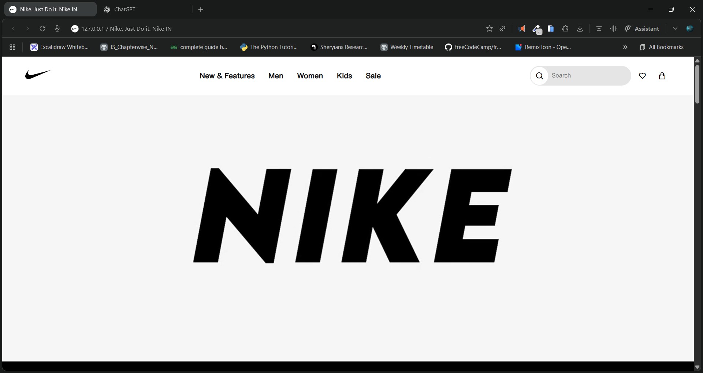
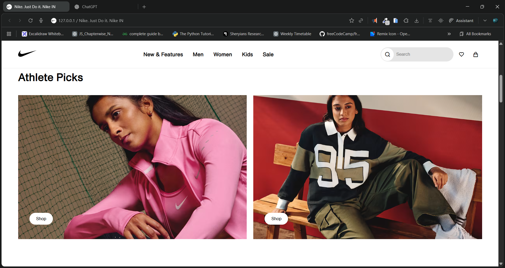
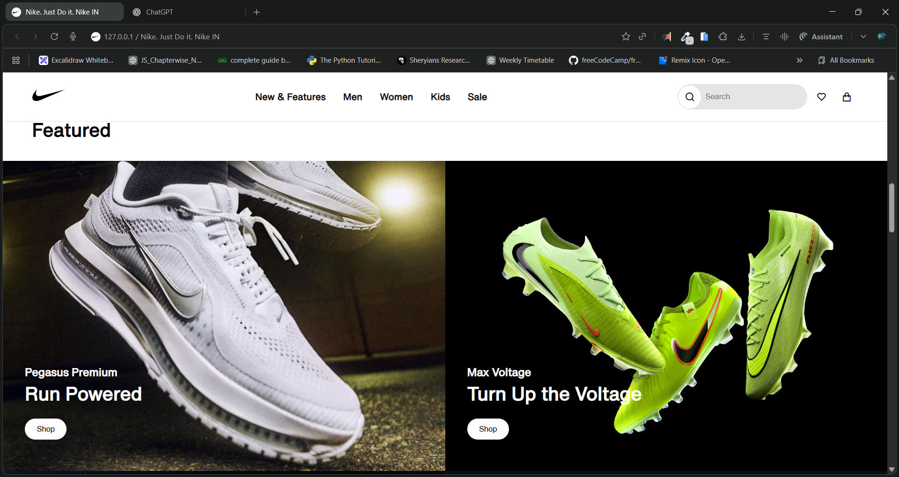
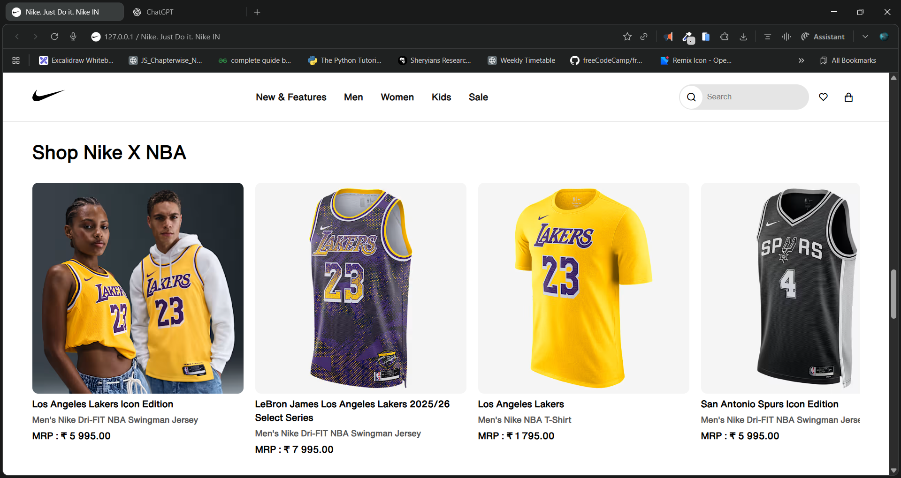
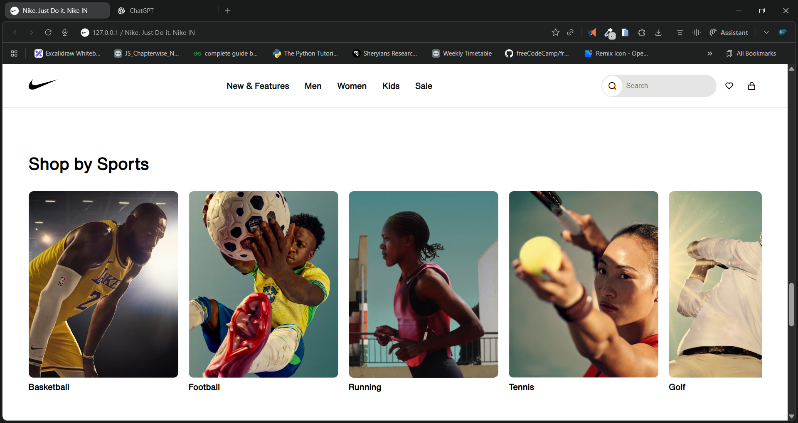
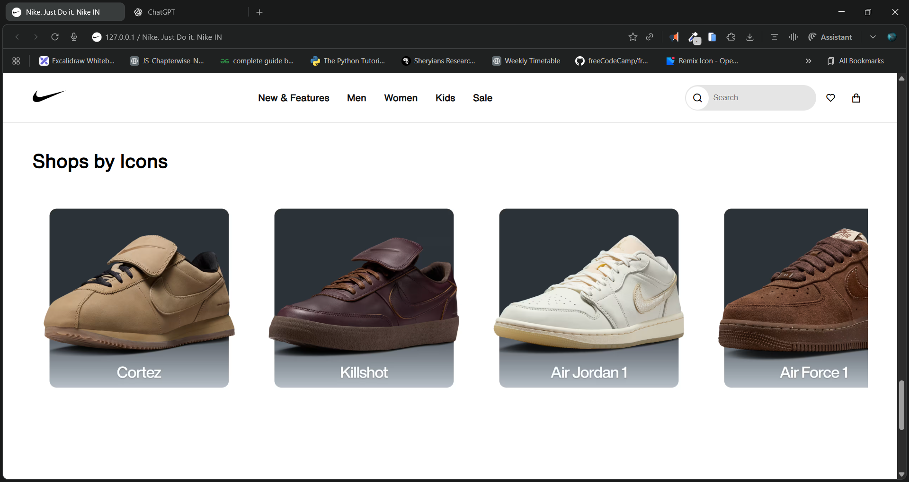
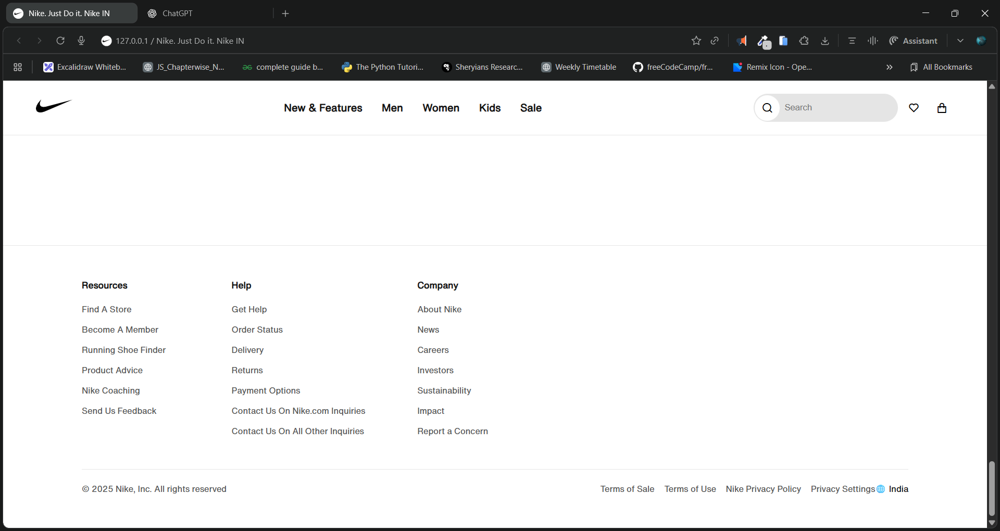

# 🏃‍♂️ Nike Clone — Just Do It

A front-end web clone of the **Nike India** official website built using **HTML, SCSS, and CSS**.
This project recreates Nike’s clean and bold design style, featuring dynamic sections like featured shoes, athlete picks, shop by sports, and more — all inspired by Nike’s real layout.

---

## 🚀 Live Demo

🔗 **Live Site:** [https://your-nike-clone-demo-link.vercel.app](https://your-nike-clone-demo-link.vercel.app)

🎥 **Demo Video:** [click here to Watch demo video](./screenshots/demo.mp4)

---

## 🧩 Tech Stack

* **HTML5** — Semantic and structured layout
* **SCSS** — Modular and organized styling
* **CSS3** — Used for hover effects and layout designs
* **Remix Icons CDN** — For icons like search, heart, and cart

---

## 📸 Project Screenshots

### 🖼️ 1. Landing Page



### 🖼️ 2. Athlete Picks Section



### 🖼️ 3. Featured Products



### 🖼️ 4. Shop Nike X NBA



### 🖼️ 5. Shop by Sports



### 🖼️ 6. Shop by Icons



### 🖼️ 7. Footer Section



---

## 📂 Folder Structure

```
Nike-Clone/
│
├── index.html
├── style.scss
├── style.css
├── /Assets
│   ├── Logo.svg
│   ├── Hero.mp4
│   ├── F 1.avif
│   ├── F 2.avif
│   ├── ...
│
└── Screenshots/
    ├── Screenshot 2025-10-15 161302.png
    ├── Screenshot 2025-10-15 161310.png
    ├── ...
```

---

## 💡 Features

✅ Elegant **navbar with dropdown mega-menus**
✅ Dynamic **video hero section**
✅ **Athlete Picks** and **Featured Products** grids
✅ **Carousels** for NBA, Sports, and Icons sections
✅ Professional **Nike-style footer**

---

## 🛠️ How to Run Locally

1. Clone the repository

   ```bash
   git clone https://github.com/yourusername/nike-clone.git
2. Open the folder in your code editor
3. Run `index.html` in your browser

---

## 📬 Contact

👤 **Developer:** Dileep
📧 Email: [dileepkumawat525@gmail.com](mailto:dileepkumawat525@gmail.com)

---

**⭐ Don’t forget to star this repository if you liked it!**
